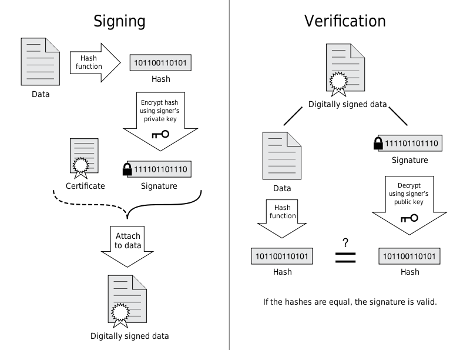

##### 什么是数字证书的证书链(certificate chain)？

一般来说，我们将自己生成的CSR提交给签名商，他们用中级证书机构的私钥Private Key给我们的签名成证书。而他们的的证书又是通过Root CA颁发的（即Root CA通过它的私钥对中级机构提交的CSR进行了签名）。

证书颁发机构是一个树形结构的。比如在验证我们XXX证书的有效性的时候，会一层层的去寻找颁发者的证书，直到自签名的根证书，然后通过相应的公钥再反过来验证下一级的数字签名的正确性。直到找到XXX的。（当然证书还有时间限制等条件）

推荐阅读:
[HTTPS为什么安全 &分析 HTTPS 连接建立全过程](http://wetest.qq.com/lab/view/110.html)
[SSL/TLS 握手过程详解](https://www.jianshu.com/p/7158568e4867)