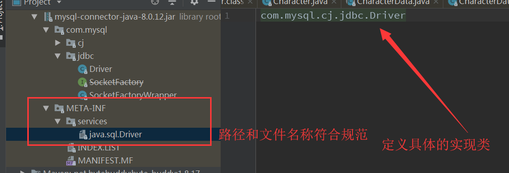
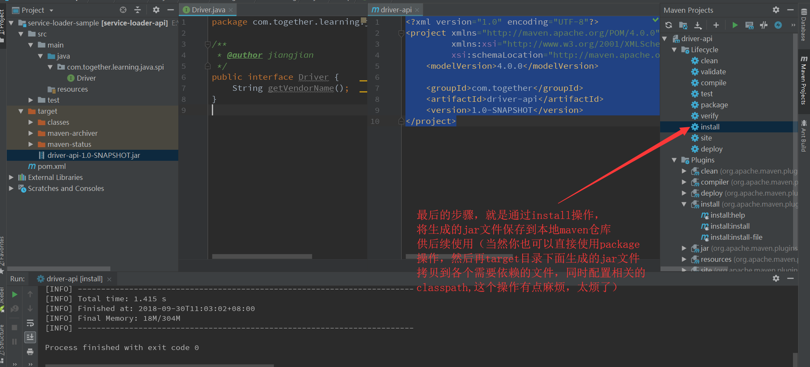
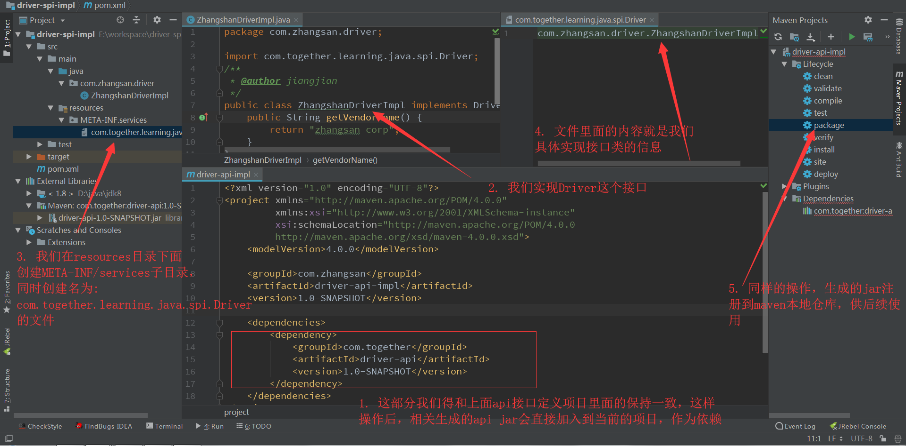
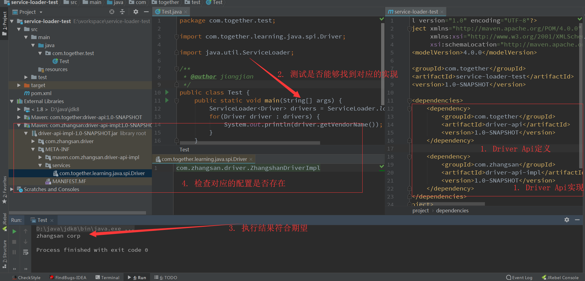

#  ServiceLoader机制深入

`ServiceLoader`是在 jdk1.6开始引入的，它主要的功能是用来完成对SPI的provider的加载.

简单理解其功能就是，根据给定的接口，找到当前接口所有实现的类.

现在给出一个这种机制的应用场景示例: jdbc的DriverManger,下面是一个代码片段

```java
import java.sql.Connection;
import java.sql.DriverManager;
import java.sql.SQLException;

Connection conn = null;
...
try {
    conn =
       DriverManager.getConnection("jdbc:mysql://localhost/test?" +
                                   "user=test&password=test");

    // Do something with the Connection

   ...
} catch (SQLException ex) {
    // handle any errors
    System.out.println("SQLException: " + ex.getMessage());
    System.out.println("SQLState: " + ex.getSQLState());
    System.out.println("VendorError: " + ex.getErrorCode());
}
```

上面这段代码本身没有很复杂，这里我们需要了解的是DriverManager是如何正确的获取到对应支持该url的Connection,下面是DriverManager的getConnection部分源码:

```java
println("DriverManager.getConnection(\"" + url + "\")");

  // Walk through the loaded registeredDrivers attempting to make a connection.
  // Remember the first exception that gets raised so we can reraise it.
  SQLException reason = null;

  for(DriverInfo aDriver : registeredDrivers) {
      // If the caller does not have permission to load the driver then
      // skip it.
      if(isDriverAllowed(aDriver.driver, callerCL)) {
          try {
              println("    trying " + aDriver.driver.getClass().getName());
              Connection con = aDriver.driver.connect(url, info);
              if (con != null) {
                  // Success!
                  println("getConnection returning " + aDriver.driver.getClass().getName());
                  return (con);
              }
          } catch (SQLException ex) {
              if (reason == null) {
                  reason = ex;
              }
          }

      } else {
          println("    skipping: " + aDriver.getClass().getName());
      }

  }
```

从上面的代码当中我们可以了解到DriverManager其实是通过不断尝试内部已经注册的Driver来获取对应的Connection,直到成功得到Connection为止，这部分还是比较好理解，这时候你会有新的疑问，
这个`registeredDrivers`是怎么注册的?（因为DriverManager本身是不知道当前应用环境有多少个实现，它是不可能通过new具体的实例来完成的)

对于`registeredDrivers`是完成它的初始化工作的，可以进一步看DriverManager这类在初始化的时候完成了相关的实现类加载，下面是加载的源码片段:

```java
/**
 * Load the initial JDBC drivers by checking the System property
 * jdbc.properties and then use the {@code ServiceLoader} mechanism
 */
static {
    loadInitialDrivers();
    println("JDBC DriverManager initialized");
}


    private static void loadInitialDrivers() {
        String drivers;
        try {
            drivers = AccessController.doPrivileged(new PrivilegedAction<String>() {
                public String run() {
                    return System.getProperty("jdbc.drivers");
                }
            });
        } catch (Exception ex) {
            drivers = null;
        }
        // If the driver is packaged as a Service Provider, load it.
        // Get all the drivers through the classloader
        // exposed as a java.sql.Driver.class service.
        // ServiceLoader.load() replaces the sun.misc.Providers()

        AccessController.doPrivileged(new PrivilegedAction<Void>() {
            public Void run() {
                //核心的操作
                ServiceLoader<Driver> loadedDrivers = ServiceLoader.load(Driver.class);
                Iterator<Driver> driversIterator = loadedDrivers.iterator();
                try{
                    while(driversIterator.hasNext()) {
                        driversIterator.next();
                    }
                } catch(Throwable t) {
                // Do nothing
                }
                return null;
            }
        });

        println("DriverManager.initialize: jdbc.drivers = " + drivers);
        ...省略
    }
```

从上面的代码可以看到，首先它通过读取系统参数来了解用户指定的driver实现，继而进一步通过`ServiceLoader`这个类完成其它的`Driver`的实现类.

现在的问题又进一步转移到`ServiceLoader`是如何找到当前系统的`Driver`的实现类的.

通过`ServiceLoader`的源码我们了解到，ServiceLoader查找对应的实现是通过一个统一规范的方式来查找，如果实现了`Driver`这个接口，你就得按ServiceLoader指定的方式来暴露你的实现.

具体的暴露方式是:
1. 在最终的jar文件的`META-INF/services/`路径下，配置当前jar实现接口的信息文件;
2. 文件的名称就是实现接口的名称，比如当前这个例子，这对应的文件名词是`java.sql.Driver`;
3. 文件里面的内容是具体的实现类完整的包信息，比如:mysql的对应实现是`com.mysql.cj.jdbc.Driver`, 所以文件里面的内容也要和这个保持一致；
   >另外需要注意的是，文件里面的内容可以是多行信息，这种情况是你提供了多种实现.
   
下面我们去看一下mysql的driver文件里面配置信息来核实一下我们的理解:


接下来，我们可以通过一个简单的例子来感受一下:

测试项目使用maven来构建
## 1 定义抽象接口
项目结构如下截图:


下面是部分文件的定义
1 Driver.java
```java
package com.together.learning.java.spi;

/**
 * @author jiangjian
 */
public interface Driver {
    String getVendorName();
}
```

2 pom.xml文件
```xml
<?xml version="1.0" encoding="UTF-8"?>
<project xmlns="http://maven.apache.org/POM/4.0.0"
         xmlns:xsi="http://www.w3.org/2001/XMLSchema-instance"
         xsi:schemaLocation="http://maven.apache.org/POM/4.0.0 http://maven.apache.org/xsd/maven-4.0.0.xsd">
    <modelVersion>4.0.0</modelVersion>

    <groupId>com.together</groupId>
    <artifactId>driver-api</artifactId>
    <version>1.0-SNAPSHOT</version>
</project>
```

## 2 实现抽象接口
项目结构如下截图:


下面是部分文件的定义
1 ZhangshanDriverImpl.java
```java
package com.zhangsan.driver;

import com.together.learning.java.spi.Driver;
/**
 * @author jiangjian
 */
public class ZhangshanDriverImpl implements Driver {
    public String getVendorName() {
        return "zhangsan corp";
    }
}

```
2 pom.xml
```xml
<?xml version="1.0" encoding="UTF-8"?>
<project xmlns="http://maven.apache.org/POM/4.0.0"
         xmlns:xsi="http://www.w3.org/2001/XMLSchema-instance"
         xsi:schemaLocation="http://maven.apache.org/POM/4.0.0
         http://maven.apache.org/xsd/maven-4.0.0.xsd">
    <modelVersion>4.0.0</modelVersion>

    <groupId>com.zhangsan</groupId>
    <artifactId>driver-api-impl</artifactId>
    <version>1.0-SNAPSHOT</version>

    <dependencies>
        <dependency>
            <groupId>com.together</groupId>
            <artifactId>driver-api</artifactId>
            <version>1.0-SNAPSHOT</version>
        </dependency>
    </dependencies>
</project>
```

3 com.together.learning.java.spi.Driver文件内容
```txt
com.zhangsan.driver.ZhangshanDriverImpl
```

## 3 测试ServiceLoader
项目结构如下截图:


下面是部分文件的定义
1 pom.xml
```xml
<?xml version="1.0" encoding="UTF-8"?>
<project xmlns="http://maven.apache.org/POM/4.0.0"
         xmlns:xsi="http://www.w3.org/2001/XMLSchema-instance"
         xsi:schemaLocation="http://maven.apache.org/POM/4.0.0 http://maven.apache.org/xsd/maven-4.0.0.xsd">
    <modelVersion>4.0.0</modelVersion>

    <groupId>com.together</groupId>
    <artifactId>service-loader-test</artifactId>
    <version>1.0-SNAPSHOT</version>

    <dependencies>
        <dependency>
            <groupId>com.together</groupId>
            <artifactId>driver-api</artifactId>
            <version>1.0-SNAPSHOT</version>
        </dependency>

        <dependency>
            <groupId>com.zhangsan</groupId>
            <artifactId>driver-api-impl</artifactId>
            <version>1.0-SNAPSHOT</version>
        </dependency>
    </dependencies>
</project>
```

2 Test.java
```java
package com.together.test;

import com.together.learning.java.spi.Driver;

import java.util.ServiceLoader;

/**
 * @author jiangjian
 */
public class Test {
    public static void main(String[] args) {
        ServiceLoader<Driver> drivers = ServiceLoader.load(Driver.class);
        for(Driver driver : drivers) {
            System.out.println(driver.getVendorName());
        }
    }
}
```

至此，ServiceLoader大致的功能介绍完了，有兴趣的可以进一步阅读ServiceLoader源码，里面的`LazyIterator`这种实现还是值得学习和借鉴的.

