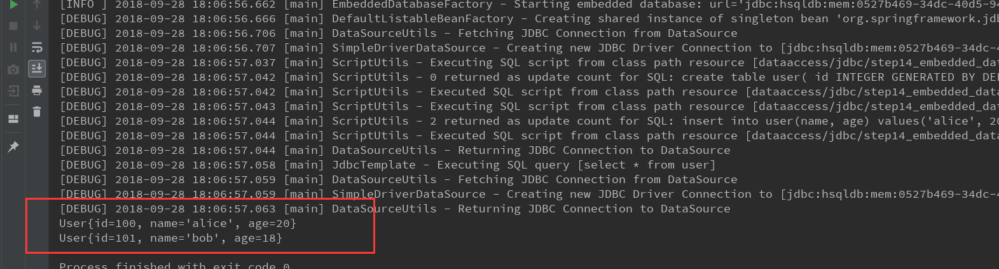

# Spring jdbc EmbeddedDatabase
内置的数据库对测试很有用，spring默认提供了H2, HSQL, Derby等类型的数据支撑，

下面介绍基于xml的配置方式,配置如下:

```xml
<?xml version="1.0" encoding="UTF-8"?>
<beans xmlns="http://www.springframework.org/schema/beans"
       xmlns:xsi="http://www.w3.org/2001/XMLSchema-instance"
       xmlns:jdbc="http://www.springframework.org/schema/jdbc" xsi:schemaLocation="
        http://www.springframework.org/schema/beans http://www.springframework.org/schema/beans/spring-beans.xsd
        http://www.springframework.org/schema/jdbc http://www.springframework.org/schema/jdbc/spring-jdbc.xsd">

    <jdbc:embedded-database id="dataSource" generate-name="true" type="HSQL"/>

    <!--
        The ignore-failures option can be set to
         NONE (the default), DROPS (ignore failed drops), or ALL (ignore all failures).

     Each statement should be separated by ; or a new line if the ;
      character is not present at all in the script.
       You can control that globally or script by script, as the following example shows:
     -->
    <jdbc:initialize-database data-source="dataSource" enabled="true" ignore-failures="DROPS" separator=";">
        <!-- The script locations can also be patterns with wildcards in the usual
         Ant style used for resources in Spring (for example, classpath*:/com/foo/**/sql/*-data.sql).
         If you use a pattern, the scripts are run in the lexical order of their URL or filename.
        -->
        <jdbc:script location="classpath:schema.sql" separator=";"/>
        <jdbc:script location="classpath:data.sql"/>
    </jdbc:initialize-database>
</beans>
```

结合具体的例子来感受一下:

1 schema.sql
```sql
create table user(
id INTEGER GENERATED BY DEFAULT AS IDENTITY(START WITH 100, INCREMENT BY 1) PRIMARY KEY,
name varchar(20),
age int);
```

2 data.sql
```sql
insert into user(name, age) values('alice', 20),('bob', 18);
```

3 User.java
```java
public class User {
    private Long id;
    private String name;
    private int age;

    public User() {
    }

    public User(Long id, String name) {
        this.id = id;
        this.name = name;
    }

    public User(String name, int age) {
        this.name = name;
        this.age = age;
    }

    public Long getId() {
        return id;
    }

    public void setId(Long id) {
        this.id = id;
    }

    public String getName() {
        return name;
    }

    public void setName(String name) {
        this.name = name;
    }

    public int getAge() {
        return age;
    }

    public void setAge(int age) {
        this.age = age;
    }

    @Override
    public String toString() {
        return "User{" +
                "id=" + id +
                ", name='" + name + '\'' +
                ", age=" + age +
                '}';
    }
}
```
4 EmbeddedDatabaseSample.java
```java
import org.springframework.context.ApplicationContext;
import org.springframework.context.support.ClassPathXmlApplicationContext;
import org.springframework.jdbc.core.JdbcTemplate;

import javax.sql.DataSource;

/**
 * @author jiangjian
 */
public class EmbeddedDatabaseSample {
    public static void main(String[] args) {
        ApplicationContext ac = new ClassPathXmlApplicationContext("classpath:dataaccess/jdbc/step14_embedded_database/spring.xml");
        JdbcTemplate jdbcTemplate = new JdbcTemplate(ac.getBean(DataSource.class));
        jdbcTemplate.query("select * from user", (rs, rowNum) -> {
            User user = new User();
            user.setId(rs.getLong("id"));
            user.setName(rs.getString("name"));
            user.setAge(rs.getInt("age"));
            return user;
        }).forEach(System.out::println);
    }
}
```

结果如下:

