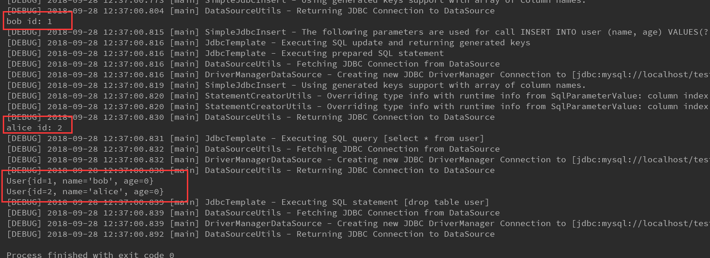

# SimpleJdbcInsert使用介绍
`SimpleJdbcInsert`主要被用来简化插入操作，

下面我们通过一个简单的示例来熟悉一下使用:

```java

import org.springframework.context.ApplicationContext;
import org.springframework.context.annotation.AnnotationConfigApplicationContext;
import org.springframework.jdbc.core.JdbcTemplate;
import org.springframework.jdbc.core.namedparam.BeanPropertySqlParameterSource;
import org.springframework.jdbc.core.simple.SimpleJdbcInsert;

import javax.sql.DataSource;
import java.util.HashMap;
import java.util.List;
import java.util.Map;

/**
 * @author jiangjian
 */
public class SimpleJdbcInsertSample {
    public static void main(String[] args) {
        ApplicationContext ac = new AnnotationConfigApplicationContext(Config.class);
        JdbcTemplate jdbcTemplate = ac.getBean(JdbcTemplate.class);
        //初始化数据库
        jdbcTemplate.execute("drop table if exists user  ");
        jdbcTemplate.execute("create table user(id int auto_increment primary key, name varchar(40), age int)");

        DataSource dataSource = ac.getBean(DataSource.class);
        SimpleJdbcInsert simpleJdbcInsert = new SimpleJdbcInsert(dataSource)
                //必须操作: 这里我们配置当前作用的table
                .withTableName("user")
                //可选操作: 这里我们可以显示的配置，我们insert语句中的column的名称，未被列出的column则不会插入值，
                //         取各自的默认值
                .usingColumns("name", "age")
                //可选操作: 这里我们配置table 自动生成的column名称，如果没有，则不需要配置，
                //         此处配置是我们想了解自动生成key的信息
                .usingGeneratedKeyColumns("id");

        //方式一
        //准备参数
        Map<String, Object> insertUser = new HashMap<>(2);
        insertUser.put("name", "bob");
        insertUser.put("age", 26);
        //调用插入，如果不需要了解自动生成字段的值，则直接调用execute方法，
        Number bobId = simpleJdbcInsert.executeAndReturnKey(insertUser);
        System.out.println("bob id: " + bobId.longValue());

        //方法二
        // 不需要调用executeAndReturnKey方法,而且传入的值可以是Map，也可以是SqlParameterSource
        Number aliceId = simpleJdbcInsert.executeAndReturnKey(new BeanPropertySqlParameterSource(new User("alice", 18)));
        System.out.println("alice id: " + aliceId.longValue());

        //输出所有用户
        List<User> findUsers = jdbcTemplate.query("select * from user",
                (rs, rowNum) -> new User(rs.getLong(1), rs.getString(2)));
        findUsers.forEach(System.out::println);

        //清理环境
        jdbcTemplate.execute("drop table user");
    }
}
```
上面的执行结果如下:


首先我们要了解是`SimpleJdbcInsert`的创建，我们需要配置`DataSource`, 同时我们也得显示指定操作对应的table信息,所以如下是最基本的配置:
```java
SimpleJdbcInsert(dataSource)
        .withTableName("user");
```

注意到上面的代码片段和示例中的区别是示例中指定了具体的 column名称（通过`usingColumns`方法)，对于上面并没有显示的给出操作的column信息，SimpleJdbInsert则是通过driver提供的metainfo去查询对应table的column信息。

最后，我们看到指定自动生成字段的名称，通过`usingGeneratedKeyColumns`完成，如果你的table没有对应的字段，或者你不需要了解这些字段的信息，则可以选择忽略这个方法的调用。

附: 上面示例其他关联类的定义

Config.java
```java
import org.springframework.beans.factory.annotation.Autowired;
import org.springframework.context.annotation.Bean;
import org.springframework.context.annotation.ComponentScan;
import org.springframework.context.annotation.Configuration;
import org.springframework.context.annotation.PropertySource;
import org.springframework.core.env.Environment;
import org.springframework.jdbc.core.JdbcTemplate;
import org.springframework.jdbc.datasource.DriverManagerDataSource;

import javax.sql.DataSource;

/**
 * @author jiangjian
 */
@Configuration
@ComponentScan
@PropertySource("classpath:jdbc.properties")
public class Config {
    @Autowired
    private Environment env;

    @Bean
    public DataSource dataSource() {
        DriverManagerDataSource dataSource = new DriverManagerDataSource();
        dataSource.setDriverClassName(env.getProperty("spring.datasource.driver-class-name"));
        dataSource.setUrl(env.getProperty("spring.datasource.url"));
        dataSource.setUsername(env.getProperty("spring.datasource.username"));
        dataSource.setPassword(env.getProperty("spring.datasource.password"));
        return dataSource;
    }

    /**
     * 这里定义JdbcTemplate的作用是设置一些数据环境，和SimpleJdbcInsert使用没有关联关系
     **/
    @Bean
    public JdbcTemplate jdbcTemplate() {
        return new JdbcTemplate(dataSource());
    }
}
```

jdbc.properties

```properties
spring.datasource.url=jdbc:mysql://localhost/test?useUnicode=true&characterEncoding=UTF-8&allowMultiQueries=true&autoReconnect=true&failOverReadOnly=false&autoReconnectForPools=true&serverTimezone=UTC
spring.datasource.username=root
spring.datasource.password=root
spring.datasource.driver-class-name=com.mysql.jdbc.Driver
```

User.java
```java
public class User {
    private Long id;
    private String name;
    private int age;

    public User() {
    }

    public User(Long id, String name) {
        this.id = id;
        this.name = name;
    }

    public User(String name, int age) {
        this.name = name;
        this.age = age;
    }

    public Long getId() {
        return id;
    }

    public void setId(Long id) {
        this.id = id;
    }

    public String getName() {
        return name;
    }

    public void setName(String name) {
        this.name = name;
    }

    public int getAge() {
        return age;
    }

    public void setAge(int age) {
        this.age = age;
    }

    @Override
    public String toString() {
        return "User{" +
                "id=" + id +
                ", name='" + name + '\'' +
                ", age=" + age +
                '}';
    }
}

```

