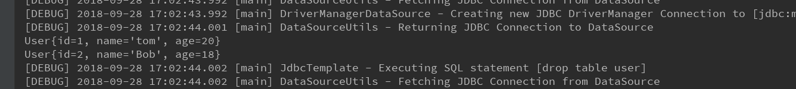

# UpdateSql
`UpdateSql`用来简化update操作，用户使用时继承这个类，在实现类中，提供相关sql和dataSource的配置.

下面是简单的一个实现类:

```java
import org.springframework.jdbc.core.SqlParameter;
import org.springframework.jdbc.object.SqlUpdate;

import javax.sql.DataSource;
import java.sql.Types;

/**
 * @author jiangjian
 */
public class UserSqlUpdate extends SqlUpdate {
    public UserSqlUpdate(DataSource ds) {
        super(ds, "update user set name=? where id=?");
        declareParameter(new SqlParameter("name", Types.VARCHAR));
        declareParameter(new SqlParameter("id", Types.BIGINT));
        compile();
    }
}

```

上面的代码中我们主要就是设置dataSource和sql, 另外我们配置了相关的parameter的名称。

完整的示例如下:
1 SqlUpdateSample.java
```java
import org.springframework.context.ApplicationContext;
import org.springframework.context.annotation.AnnotationConfigApplicationContext;
import org.springframework.jdbc.core.JdbcTemplate;

import javax.sql.DataSource;
import java.util.List;

/**
 * @author jiangjian
 */
public class SqlUpdateSample {
    public static void main(String[] args) {
        ApplicationContext ac = new AnnotationConfigApplicationContext(Config.class);
        JdbcTemplate jdbcTemplate = ac.getBean(JdbcTemplate.class);
        DataSource dataSource = ac.getBean(DataSource.class);
        //初始化数据库
        jdbcTemplate.execute("drop table if exists user  ");
        jdbcTemplate.execute("create table user(id int auto_increment primary key, name varchar(40), age int)");
        jdbcTemplate.execute("insert into user(name, age) values('alice', 20),('Bob', 18)");

        UserSqlUpdate userSqlUpdate = new UserSqlUpdate(dataSource);
        userSqlUpdate.update("tom", 1);

        UsersMappingSqlQuery usersMappingSqlQuery = new UsersMappingSqlQuery(dataSource);
        List<User> users = usersMappingSqlQuery.execute();
        users.forEach(System.out::println);

        //清理环境
        jdbcTemplate.execute("drop table user");
    }
}

```
执行效果如下图:


2 Config.java
```java
package com.together.learning.spring.dataaccess.jdbc.step13_sqlupdate;

import org.springframework.beans.factory.annotation.Autowired;
import org.springframework.context.annotation.Bean;
import org.springframework.context.annotation.ComponentScan;
import org.springframework.context.annotation.Configuration;
import org.springframework.context.annotation.PropertySource;
import org.springframework.core.env.Environment;
import org.springframework.jdbc.core.JdbcTemplate;
import org.springframework.jdbc.datasource.DriverManagerDataSource;

import javax.sql.DataSource;

/**
 * @author jiangjian
 */
@Configuration
@ComponentScan
@PropertySource("classpath:dataaccess/jdbc/step12_mappingsqlquerry/jdbc.properties")
public class Config {
    @Autowired
    private Environment env;

    @Bean
    public DataSource dataSource() {
        DriverManagerDataSource dataSource = new DriverManagerDataSource();
        dataSource.setDriverClassName(env.getProperty("spring.datasource.driver-class-name"));
        dataSource.setUrl(env.getProperty("spring.datasource.url"));
        dataSource.setUsername(env.getProperty("spring.datasource.username"));
        dataSource.setPassword(env.getProperty("spring.datasource.password"));
        return dataSource;
    }

    /**
     *  UpdateSql的使用和JdbcTemplate没有多大的关联，这里使用jdbcTemplate主要是为了设置相关环境
     **/
    @Bean
    public JdbcTemplate jdbcTemplate() {
        return new JdbcTemplate(dataSource());
    }
}
```

3 User.java
```java
public class User {
    private Long id;
    private String name;
    private int age;

    public User() {
    }

    public User(Long id, String name) {
        this.id = id;
        this.name = name;
    }

    public User(String name, int age) {
        this.name = name;
        this.age = age;
    }

    public Long getId() {
        return id;
    }

    public void setId(Long id) {
        this.id = id;
    }

    public String getName() {
        return name;
    }

    public void setName(String name) {
        this.name = name;
    }

    public int getAge() {
        return age;
    }

    public void setAge(int age) {
        this.age = age;
    }

    @Override
    public String toString() {
        return "User{" +
                "id=" + id +
                ", name='" + name + '\'' +
                ", age=" + age +
                '}';
    }
}
```

4 UsersMappingSqlQuery.java
```java
import org.springframework.jdbc.object.MappingSqlQuery;

import javax.sql.DataSource;
import java.sql.ResultSet;
import java.sql.SQLException;

/**
 * @author jiangjian
 */
public class UsersMappingSqlQuery extends MappingSqlQuery<User> {
    public UsersMappingSqlQuery(DataSource dataSource) {
        super(dataSource, "select id, name, age from user");
        compile();
    }

    @Override
    protected User mapRow(ResultSet rs, int rowNum) throws SQLException {
        User user = new User();
        user.setId(rs.getLong("id"));
        user.setName(rs.getString("name"));
        user.setAge(rs.getInt("age"));
        return user;
    }
}
```

5 jdbc.properties
```properties
spring.datasource.url=jdbc:mysql://localhost/test?useUnicode=true&characterEncoding=UTF-8&allowMultiQueries=true&autoReconnect=true&failOverReadOnly=false&autoReconnectForPools=true&serverTimezone=UTC
spring.datasource.username=root
spring.datasource.password=root
spring.datasource.driver-class-name=com.mysql.jdbc.Driver
```