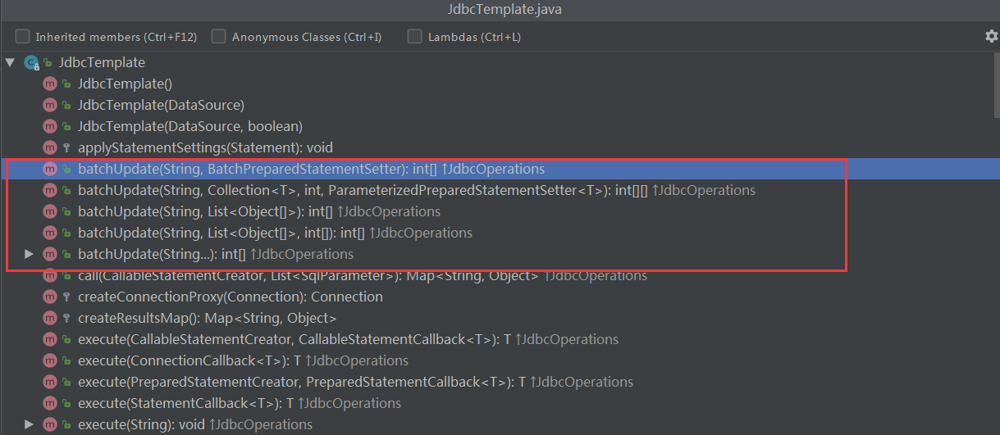

# JdbcTemplate批量插入

`JdbcTemplate`支持批量命令的操作，我们先简单了解一下`JdbcTemplate`的API接口支持情况:



从上面的截图中我们可以了解当前有5个方法，注意这些方法都是JdbcTemplate实现`JdbcOperations`接口而来的方法

```java
int[] batchUpdate(String sql, final BatchPreparedStatementSetter pss) throws DataAccessException;

int[] batchUpdate(String sql, List<Object[]> batchArgs) throws DataAccessException;

int[] batchUpdate(String sql, List<Object[]> batchArgs, int[] argTypes) throws DataAccessException;

<T> int[][] batchUpdate(String sql, Collection<T> batchArgs, int batchSize,
    ParameterizedPreparedStatementSetter<T> pss) throws DataAccessException;
    
int[] batchUpdate(String... sql) throws DataAccessException;
```

我们对其中的一两个方法给出简单的示例

## 1. int[] batchUpdate(String sql, final BatchPreparedStatementSetter pss) throws DataAccessException
使用这个方法的时候需要我们去提供`BatchPreparedStatementSetter`接口的实现，下面是这个接口的定义:
```java
public interface BatchPreparedStatementSetter {

	/**
	 * Set parameter values on the given PreparedStatement.
	 * @param ps the PreparedStatement to invoke setter methods on
	 * @param i index of the statement we're issuing in the batch, starting from 0
	 * @throws SQLException if a SQLException is encountered
	 * (i.e. there is no need to catch SQLException)
	 */
	void setValues(PreparedStatement ps, int i) throws SQLException;

	/**
	 * Return the size of the batch.
	 * @return the number of statements in the batch
	 */
	int getBatchSize();

}
```
因此实现这个方法的时候，我们得明确的提供批操作中的语句数量，通过`getBatchSize`方法给出，另外我们要给出批操作中每个独立语句的内容，这种情况下我们需要实现的就是`setValues`这个方法。

示例:

1. Config.java文件

```java
import org.springframework.beans.factory.annotation.Autowired;
import org.springframework.context.annotation.Bean;
import org.springframework.context.annotation.ComponentScan;
import org.springframework.context.annotation.Configuration;
import org.springframework.context.annotation.PropertySource;
import org.springframework.core.env.Environment;
import org.springframework.jdbc.core.JdbcTemplate;
import org.springframework.jdbc.datasource.DriverManagerDataSource;

import javax.sql.DataSource;

/**
 * @author jiangjian
 */
@Configuration
@ComponentScan
@PropertySource("classpath:jdbc.properties")
public class Config {
    @Autowired
    private Environment env;

    @Bean
    public DataSource dataSource() {
        DriverManagerDataSource dataSource = new DriverManagerDataSource();
        dataSource.setDriverClassName(env.getProperty("spring.datasource.driver-class-name"));
        dataSource.setUrl(env.getProperty("spring.datasource.url"));
        dataSource.setUsername(env.getProperty("spring.datasource.username"));
        dataSource.setPassword(env.getProperty("spring.datasource.password"));
        return dataSource;
    }

    @Bean
    public JdbcTemplate jdbcTemplate() {
        return new JdbcTemplate(dataSource());
    }
}
```
2. jdbc.prperites文件

```Properties
spring.datasource.url=jdbc:mysql://localhost/test?useUnicode=true&characterEncoding=UTF-8&allowMultiQueries=true&autoReconnect=true&failOverReadOnly=false&autoReconnectForPools=true&serverTimezone=UTC
spring.datasource.username=root
spring.datasource.password=root
spring.datasource.driver-class-name=com.mysql.jdbc.Driver
```

3. 测试主类 JdbcTemplateBatchOperationSample.java

```java
import org.springframework.context.ApplicationContext;
import org.springframework.context.annotation.AnnotationConfigApplicationContext;
import org.springframework.jdbc.core.BatchPreparedStatementSetter;
import org.springframework.jdbc.core.JdbcTemplate;

import java.sql.PreparedStatement;
import java.sql.SQLException;
import java.util.ArrayList;
import java.util.Arrays;
import java.util.List;

/**
 * @author jiangjian
 */
public class JdbcTemplateBatchOperationSample {
    public static void main(String[] args) {
        ApplicationContext ac = new AnnotationConfigApplicationContext(Config.class);
        JdbcTemplate jdbcTemplate = ac.getBean(JdbcTemplate.class);
        
        //准备环境
        jdbcTemplate.execute("drop table if exists user  ");
        jdbcTemplate.execute("create table user(id int auto_increment primary key, name varchar(40))");

        //这里面我们需要批量插入多个用户，所以我们这里先定义了待插入用户的列表，
        // 这个列表可以方便实现BatchPreparedStatementSetter接口，比如:获取
        // 批操作的大小 <==> uses.size()即可
        List<String> users = Arrays.asList("Alice", "Bob");
        jdbcTemplate.batchUpdate("insert into user(name) values(?)", new BatchPreparedStatementSetter() {
            @Override
            public void setValues(PreparedStatement ps, int i) throws SQLException {
                ps.setString(1, users.get(i));
            }

            @Override
            public int getBatchSize() {
                return users.size();
            }
        });

        Long count = jdbcTemplate.queryForObject("select count(*) from user", Long.class);
        System.out.println("count is :" + count);
        
        //清空环境
        jdbcTemplate.execute("drop table user");
    }
}
```

## 2. int[] batchUpdate(String sql, List<Object[]> batchArgs) throws DataAccessException;
这个方法操作同上面介绍的区别在于它是直接通过传入操作自身来判断上述对应的`batchSize`, 而每个独立语句的参数则是通过内部的Object[]提供，下面写出如果使用当前方法的写法(其他部分代码都类似):

```java
       //另外一种方式去批量插入
       List<Object[]> users = new ArrayList<>();
       users.add(new Object[]{"Jim"});
       users.add(new Object[]{"Tom"});
       jdbcTemplate.batchUpdate("insert into user(name) value(?)", users);
       Long count = jdbcTemplate.queryForObject("select count(*) from user", Long.class);
       System.out.println("count is :" + count);
```
preparedStatement的参数是通过List中的Object[]给出，底层根据Object[]中元素对应的java 类型，来调用合适的preparedStatement.setXXX方法，但是这样操作可能会存在问题，比如如果给出的值是`null`这时候会导致问题的方式，Spring默认会通过调用`ParameterMetaData.getParameterType`方法来获取对应placeholder的类型，这种操作对于某些jdbc driver或者数据库产品（比如: n Oracle 12c (SPR-16139))会造成很大的性能开销，如果出现这种情况，可以尝试使用`int[] batchUpdate(String sql, List<Object[]> batchArgs, int[] argTypes) throws DataAccessException;`方法，来显示指定具体的place holder的类型， 另外可以通过配置`spring.jdbc.getParameterType.ignore`为`true`来禁用上面的`ParameterMetaData.getParameterType`的操作。

# 3. <T> int[][] batchUpdate(String sql, Collection<T> batchArgs, int batchSize,
    ParameterizedPreparedStatementSetter<T> pss) throws DataAccessException;

其他方法请自行尝试

