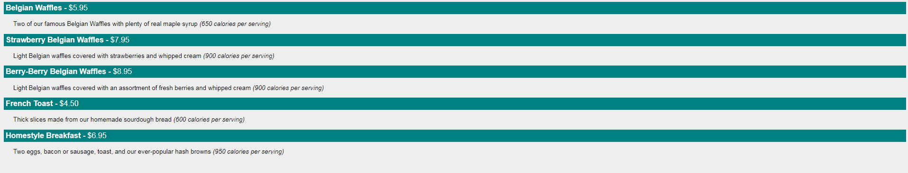

# 8 XSLT

>通过XSLT，你可以将XML文档转化为HTM

## Displaying XML with XSLT

XSLT (eXtensible Stylesheet Language Transformations) 是XML推荐的样式语言(style sheet language).

XSLT远远比CSS要复杂且全面，通过使用XSLT，你可以在最终输出文件里面增加或者删除某些元素(elements)和属性(attributes),你也可以重新进行调整排序、执行测试，以及根据某些条件来控制元素的显示与否，等等。

XSLT使用XPath来查找XML文档中的信息.

## XSLT 示例

We will use the following XML document:
我们使用如下的XML文档：
```xml
<?xml version="1.0" encoding="UTF-8"?>
<breakfast_menu>

<food>
<name>Belgian Waffles</name>
<price>$5.95</price>
<description>Two of our famous Belgian Waffles with plenty of real maple syrup</description>
<calories>650</calories>
</food>

<food>
<name>Strawberry Belgian Waffles</name>
<price>$7.95</price>
<description>Light Belgian waffles covered with strawberries and whipped cream</description>
<calories>900</calories>
</food>

<food>
<name>Berry-Berry Belgian Waffles</name>
<price>$8.95</price>
<description>Light Belgian waffles covered with an assortment of fresh berries and whipped cream</description>
<calories>900</calories>
</food>

<food>
<name>French Toast</name>
<price>$4.50</price>
<description>Thick slices made from our homemade sourdough bread</description>
<calories>600</calories>
</food>

<food>
<name>Homestyle Breakfast</name>
<price>$6.95</price>
<description>Two eggs, bacon or sausage, toast, and our ever-popular hash browns</description>
<calories>950</calories>
</food>

</breakfast_menu>
```

在浏览器显示之前， 我们定义XSLT, 使其将XML转化为HTML,
```xslt
<?xml version="1.0" encoding="UTF-8"?>
<html xsl:version="1.0" xmlns:xsl="http://www.w3.org/1999/XSL/Transform">
<body style="font-family:Arial;font-size:12pt;background-color:#EEEEEE">
<xsl:for-each select="breakfast_menu/food">
  <div style="background-color:teal;color:white;padding:4px">
    <span style="font-weight:bold"><xsl:value-of select="name"/> - </span>
    <xsl:value-of select="price"/>
    </div>
  <div style="margin-left:20px;margin-bottom:1em;font-size:10pt">
    <p>
    <xsl:value-of select="description"/>
    <span style="font-style:italic"> (<xsl:value-of select="calories"/> calories per serving)</span>
    </p>
  </div>
</xsl:for-each>
</body>
</html>
```

最终的结果是：




如果想进一步学习和了解XSLT，请参考由W3cSchool的系列教程:

https://www.w3schools.com/xml/xsl_intro.asp